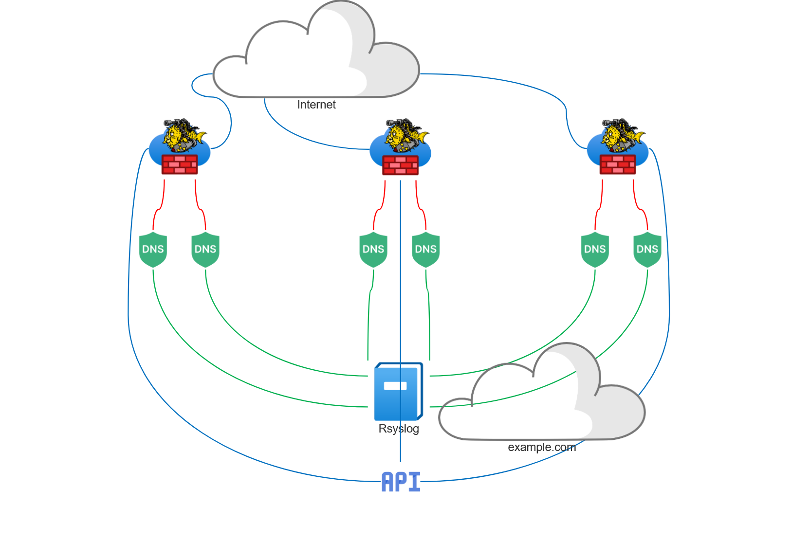

# Distributed Block List (CIDR) From BIND Rate-Limit Log Data.


The above diagram illustrates a small portion of a network, focusing on the DNS servers and the openbsd firewalls. The way this whole thing works is pretty simple.
All BIND DNS servers are logging their rate limit messages to the rsyslog server, the CIDR is then extracted from the message and a key in the format cidr:xxx.xxx.xxx.xxx/24 with expiration is created (we do not want to block networks for eternity). 
Openbsd firewalls has the following rules:
```
 table <dnsbl> persist file "/etc/dnsblcidr.txt"
 block in quick on $ext_if inet                         from <dnsbl> to $dnsserv
 block out quick on $ext_if inet                        from $dnsserv to <dnsbl>
```
Then every 10 minutes a cron job on the OpenBSD firewalls is executed:
```
 */10 * * * * /usr/bin/ftp -o /etc/dnsblcidr.txt http://192.168.1.2:8080/cidrs && pfctl -t dnsbl -Treplace -f /etc/dnsblcidr.txt
```

### named.conf
```
options {
...
        rate-limit {
                responses-per-second 10;
                all-per-second 10;
                qps-scale 100;
                ipv4-prefix-length 24;
                window 60;
                min-table-size 10000;
                max-table-size 20000;

        };
...
};
...
logging {
        ...
        channel rate_limit {
                syslog local0;
                severity info;
                print-severity yes;
                print-category yes;
                print-time yes;
        };
        category rate-limit { rate_limit; };
        ...
};
...
```

### rsyslog.conf
```
...
local0.* @@192.168.1.2:514
...
```

### docker-compose example:
```
bind-rate-limit-parse-redis:
    image: ghcr.io/cremator/bind-rate-limit-parse-redis
    container_name: bind-rate-limit-parse-redis
    restart: unless-stopped
    environment:
      - TZ=Europe/Sofia
    command:
      - --redis #Default "localhost:6379", "Redis server address")
      - --redisprefix #Default "cidrs:", "Prefix for keys to store CIDRs")
      - --webprefix #Default "/cidrs", "Prefix for HTTP API CIDRs endpoint")
      - --expiration #Default time.Hour*24, "Expiration time for individual CIDRs (in seconds)")
      - --randomness #Default 1.5, "Expiration time randomness")
      - --redisdb #Default 2, "Select Redis DB")
      - --port #Default "8080", "HTTP server port")
      - --redis-delay #Default time.Millisecond*500, "Delay Redis Inserts duration")
    ports:
      - 8053:8053
      - 514:514/udp
      - 514:514/tcp
    depends_on:
      - redis-stack
```
